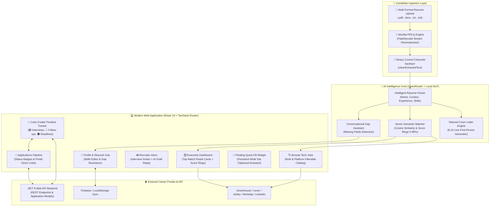

# 🚀 JobPilot — Autonomous AI Job Application Tracker & Career Copilot

<div align="center">


**JobPilot watches 50,000+ career pages across Workday, Greenhouse, Lever, and Ashby, parses your résumé, detects missing application fields, scores compatibility, generates 8–10 line tailored first-person cover letters, auto-fills application forms with 1 click, and tracks interview stages in an interactive color-coded calendar.**

[Live Dashboard Demo](http://localhost:5173/dashboard) • [Browse Jobs](http://localhost:5173/browse) • [Interview Tracker](http://localhost:5173/tracker) • [Candidate Profile](http://localhost:5173/profile)

</div>

---

## 🏗️ System Architecture



---

## 🌟 Unique "WOW" Features (That Don't Exist in Standard Trackers)

### 1. ⚡ In-Browser Mozilla PDF.js & FlateDecode Stream Engine
- **Zero Binary Corruption**: Decodes modern compressed PDF streams (`FlateDecode`), font tables, glyph mappings, and XML paragraphs (`.docx`) client-side without sending raw files to an untrusted server.
- **Automated Text Sanitizer**: Cleanses non-printable binary artifacts and normalizes line breaks before LLM embedding.

### 2. 🧩 1-Click Career Portal Auto-Fill Sheet & Master Bundle
- **1-Click Field Helper**: Instant clipboard copy buttons for First Name, Last Name, Email, Phone, City, Experience, LinkedIn, and Portfolio.
- **Master Bundle Copy**: Copies all application responses in a single structured clipboard payload.
- **Floating Quick-Fill Widget**: Docked assistant that stays on screen while candidate completes forms across external tabs.

### 3. ✍️ Tailored 8–10 Line First-Person Cover Letter Generator
- **Zero Generic Advice**: Never outputs generic resume tips or advice.
- **Direct & Personalized**: Produces an authentic, role-specific first-person letter starting directly with:
  > *"Hi, I'm Alex Carter applying for the Senior Full Stack Engineer position at Stripe. I'm interested in joining Stripe because of your team's commitment to building cutting-edge, high-impact products..."*

### 4. 📅 Color-Coded Interview & Process Timeline Calendar
- **🟢 Emerald Green (`bg-emerald-500`)**: Scheduled Interviews *(Technical System Design, Live Coding, Onsite Loop)*.
- **🔵 Sky Blue (`bg-blue-500`)**: Recruiter Follow-ups and outreach check-ins.
- **🟠 Amber (`bg-amber-500`)**: Assessment Deadlines and Take-home challenges.
- **🟣 Purple (`bg-purple-500`)**: Status Updates and Offer Decision Deadlines.
- Features real-time count filter pills, interactive monthly grid, day agenda drawer, and built-in event scheduler.

### 5. 🎯 Conversational AI Missing Field Gap Assistant
- Automatically identifies incomplete profile data (missing phone number, target role, city, or skills) before applying.
- Modal allows candidate to fill missing items in seconds with live synchronization back to their profile.

### 6. 🪟 Executive Dashboard with Circular Score Rings
- 4 pastel-themed match cards (🟡 Warm Amber, 🟢 Mint Green, 🟣 Soft Violet, 🔴 Light Rose) with animated SVG circular percentage rings (`71%`, `64%`, `60%`, `58%`).
- Clean light mode default styling with high-contrast slate typography.

### 7. 🔙 Master Multi-Page Navigation with "Back to Website"
- Dedicated URLs for `/dashboard`, `/browse`, `/applications`, `/inbox`, `/tracker`, `/profile`, `/settings`.
- Top **`← Back to Website`** return button to seamlessly switch between the application tracker and landing page.

---

## 📂 Project Structure

```text
Job-Application-Tracker/
├── Frontend/                          # React 19 + TypeScript + Vite Application
│   ├── src/
│   │   ├── components/                # Reusable UI Components & Modals
│   │   │   ├── dashboard-sidebar.tsx  # Left sidebar with active state & Back button
│   │   │   ├── apply-portal-modal.tsx # 1-Click Auto-Fill sheet & Cover Letter
│   │   │   ├── interview-calendar-modal.tsx # Color-coded interactive calendar
│   │   │   ├── missing-fields-modal.tsx # AI Gap Assistant
│   │   │   ├── quick-fill-widget.tsx  # Floating multi-tab form helper
│   │   │   ├── suggested-jobs-section.tsx # Job discovery cards & filters
│   │   │   └── landing/               # Marketing Landing Page Components
│   │   ├── lib/                       # Core Logic & Services
│   │   │   ├── ai.ts                  # OpenRouter LLM, parser, & cover letter generator
│   │   │   ├── resume-parser.ts       # Mozilla PDF.js & DOCX text extraction
│   │   │   ├── jobs-catalog.ts        # Curated real-world ATS job openings
│   │   │   ├── profile.ts             # User Profile & Gap Detection helpers
│   │   │   ├── applications-service.ts# Application CRUD & API integration
│   │   │   ├── reminders-service.ts   # Interview calendar reminders data layer
│   │   │   └── __tests__/             # Vitest Automated Test Suite (26 tests)
│   │   ├── routes/                    # TanStack File-Based Routes
│   │   │   ├── index.tsx              # Landing Page (/)
│   │   │   ├── dashboard.tsx          # Executive Dashboard (/dashboard)
│   │   │   ├── browse.tsx             # Job Discovery (/browse)
│   │   │   ├── applications.index.tsx # Pipeline Management (/applications)
│   │   │   ├── applications.$applicationId.tsx # Dossier Details (/applications/:id)
│   │   │   ├── inbox.tsx              # Recruiter Messages (/inbox)
│   │   │   ├── tracker.tsx            # Timeline Calendar (/tracker)
│   │   │   ├── profile.tsx            # Résumé Ingestion Hub (/profile)
│   │   │   └── settings.tsx           # Preferences & JSON Export (/settings)
│   │   └── styles.css                 # Tailwind CSS v4 & OKLCH Design Tokens
│   └── package.json
│
├── Backend/                           # .NET 8 Web API
│   └── JobTracker.Api/
│       ├── Controllers/               # REST API Controllers (Applications, Reminders)
│       ├── Models/                    # Application, Reminder, Document C# DTOs
│       ├── Services/                  # In-Memory & Firestore Repository services
│       └── Program.cs                 # ASP.NET Core application entry point
│
├── firestore.rules                    # Firebase Security Rules
└── README.md                          # Master Project Documentation
```

---

## 🛠️ Tech Stack & Dependencies

| Area | Technologies |
| :--- | :--- |
| **Frontend Framework** | React 19, TypeScript 5.8, Vite 8 |
| **Routing & State** | TanStack Router, TanStack Query |
| **Styling & Icons** | Tailwind CSS v4, Lucide React, Date-fns, Sonner, Vaul |
| **PDF Extraction** | Mozilla PDF.js (`pdfjs-dist`) with client-side stream decoding |
| **AI Intelligence** | OpenRouter API (`nvidia/nemotron-3-ultra`, `google/gemma-4`, embeddings) + Local NLP Fallbacks |
| **Backend API** | ASP.NET Core 8 Web API (.NET 8 SDK, C#) |
| **Authentication & DB** | Firebase Web Auth, Firestore / In-Memory Repository |
| **Testing** | Vitest, JSDOM, Coverage-v8 (26/26 passing tests) |

---

## 🚀 Quick Start & Installation

### Prerequisites
- **Node.js** `v20+` or `v22+`
- **npm** `10+` or **bun**
- **.NET 8 SDK** (for running the C# backend API)

### 1. Clone the Repository
```bash
git clone https://github.com/harshit1arora/Job-Application-Tracker.git
cd Job-Application-Tracker
```

### 2. Configure Environment Variables
Create a `.env` file in the `Frontend/` folder:
```env
VITE_OPENROUTER_API_KEY=your_openrouter_api_key_here

# Firebase Configuration
VITE_FIREBASE_API_KEY=your_firebase_api_key
VITE_FIREBASE_AUTH_DOMAIN=your_project.firebaseapp.com
VITE_FIREBASE_PROJECT_ID=your_project_id
VITE_FIREBASE_STORAGE_BUCKET=your_project.firebasestorage.app
VITE_FIREBASE_MESSAGING_SENDER_ID=your_sender_id
VITE_FIREBASE_APP_ID=your_app_id
```

### 3. Start the Frontend
```bash
cd Frontend
npm install
npm run dev
```
Open **`http://localhost:5173`** in your browser.

### 4. (Optional) Start the .NET Backend API
```bash
cd Backend/JobTracker.Api
dotnet run
```
API runs locally on `http://localhost:5117` and is automatically proxied by Vite.

---

## 🧪 Automated Testing

To run the complete unit and integration test suite:

```bash
cd Frontend
npm test
```

### Test Suite Summary:
```text
✓ src/lib/ai.test.ts (6 tests)
    ✓ builds an authentic 8-10 line first-person cover letter for specific job and company
✓ src/lib/__tests__/resume-ai-pipeline.test.ts (5 tests)
    ✓ parses candidate resume text into structured fields
    ✓ identifies missing critical fields in incomplete profiles
    ✓ merges parsed resume into user profile accurately
    ✓ matches and ranks suggested jobs based on candidate skills and role
    ✓ sanitizes garbled binary stream text into clean strings
✓ src/lib/__tests__/reminders-calendar.test.ts (2 tests)
    ✓ fetches seeded color-coded calendar reminders for candidate
    ✓ allows candidate to schedule a new interview round on calendar
✓ src/lib/__tests__/applications-service.test.ts (6 tests)
✓ src/lib/__tests__/reminders-service.test.ts (3 tests)
✓ src/lib/__tests__/documents-service.test.ts (3 tests)
✓ src/lib/__tests__/dashboard-service.test.ts (1 test)

Test Files  7 passed (7)
     Tests  26 passed (26)
```

---

## 📄 License
This project is open source and available under the [MIT License](LICENSE).
