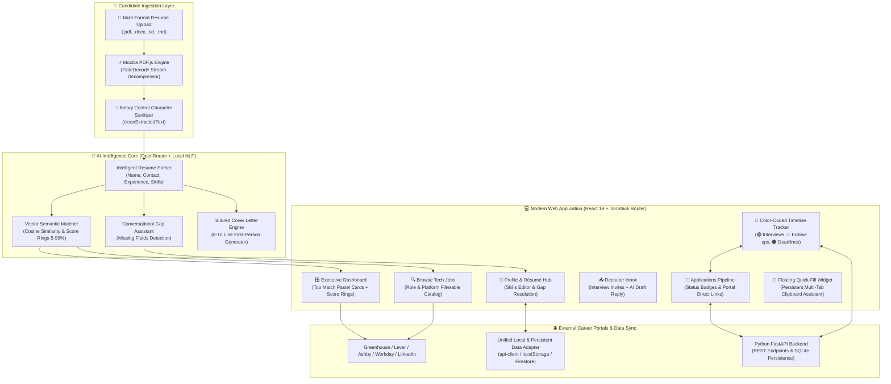

# 🚀 JobPilot — Autonomous AI Job Application Tracker & Career Copilot

<div align="center">


**JobPilot parses your résumé, detects missing application fields, scores candidate readiness and career intelligence, generates tailored first-person cover letters, provides 1-click clipboard auto-fill, and tracks application pipelines and interview timelines in an interactive color-coded calendar.**

[Live Dashboard Demo](http://localhost:5173/dashboard) • [Browse Jobs](http://localhost:5173/browse) • [Interview Tracker](http://localhost:5173/tracker) • [Candidate Profile](http://localhost:5173/profile)

</div>

---

## 🏗️ System Architecture


```mermaid
flowchart TB
    subgraph Candidate["👤 Candidate Ingestion Layer"]
        ResumeUpload["📄 Multi-Format Resume Upload\n(.pdf, .docx, .txt, .md)"]
        PdfJsEngine["⚡ Mozilla PDF.js Engine\n(FlateDecode Stream Decompressor)"]
        TextSanitizer["🧹 Binary Control Character Sanitizer\n(cleanExtractedText)"]
        ResumeUpload --> PdfJsEngine --> TextSanitizer
    end

    subgraph AIEngine["🤖 AI Intelligence Core (OpenRouter + Local NLP)"]
        AiParser["Intelligent Resume Parser\n(Name, Contact, Experience, Skills)"]
        GapDetector["Conversational Gap Assistant\n(Missing Fields Detection)"]
        JobMatcher["Vector Semantic Matcher\n(Cosine Similarity & Score Rings 5-99%)"]
        LetterGen["Tailored Cover Letter Engine\n(8-10 Line First-Person Generator)"]
        
        TextSanitizer --> AiParser
        AiParser --> GapDetector
        AiParser --> JobMatcher
        AiParser --> LetterGen
    end

    subgraph UI["💻 Modern Web Application (React 19 + TanStack Router)"]
        Dashboard["🪟 Executive Dashboard\n(Top Match Pastel Cards + Score Rings)"]
        BrowseJobs["🔍 Browse Tech Jobs\n(Role & Platform Filterable Catalog)"]
        Applications["📄 Applications Pipeline\n(Status Badges & Portal Direct Links)"]
        Inbox["📥 Recruiter Inbox\n(Interview Invites + AI Draft Reply)"]
        CalendarTracker["📅 Color-Coded Timeline Tracker\n(🟢 Interviews, 🔵 Follow-ups, 🟠 Deadlines)"]
        ProfileHub["👤 Profile & Résumé Hub\n(Skills Editor & Gap Resolution)"]
        QuickFill["🧩 Floating Quick-Fill Widget\n(Persistent Multi-Tab Clipboard Assistant)"]

        JobMatcher --> Dashboard
        JobMatcher --> BrowseJobs
        GapDetector --> ProfileHub
        CalendarTracker <--> Applications
    end

    subgraph Integration["🌐 External Career Portals & Data Sync"]
        Portals["Greenhouse / Lever / Ashby / Workday / LinkedIn"]
        DataSync["Unified Local & Persistent Data Adapter\n(api-client / localStorage / Firestore)"]
        FastApi["Python FastAPI Backend\n(REST Endpoints & SQLite Persistence)"]

        Dashboard --> Portals
        BrowseJobs --> Portals
        Applications <--> FastApi
        CalendarTracker <--> FastApi
        ProfileHub <--> DataSync
    end
```

---

## 🌟 Comprehensive Features & Capabilities

### 1. ⚡ Client-Side PDF.js & FlateDecode Stream Engine
- **Zero Binary Stream Corruption**: Employs Mozilla PDF.js (`pdfjs-dist`) for in-browser client-side parsing of modern compressed PDF streams (`FlateDecode`), font tables, glyph mappings, and `.docx` XML archives without sending raw documents to external servers.
- **Automated Text Sanitizer (`cleanExtractedText`)**: Cleanses non-printable control characters, null bytes, and normalizes formatting prior to LLM analysis.

### 2. 🎯 Unified Career Intelligence & Next Best Action Coach
- **Explainable 6-Factor Readiness Formula**:
  - Deterministic candidate-to-job calculation balancing Resume Match (35%), Required Skills (20%), Project Evidence (15%), Experience Relevance (10%), Seniority Fit (10%), and Profile Completeness (10%).
  - Never inflates weak candidates with arbitrary defaults; provides actionable positive signals and readiness reducers.
- **Living Career Twin**:
  - Models candidate skills, seniority, experience years, and practical projects.
  - Interactive STAR-method technical interview simulator with instant scoring and qualitative feedback.
- **Evidence-Based Skill Proof Hierarchy**:
  - Tracks skill evidence through 4 rigorous levels: Claimed (25%) → Résumé Mention (50%) → Practical Project Demonstration (75%) → Technical Verification Challenge (100%).
- **Closed-Loop Action Completion Engine**:
  - Completing recommended actions (verifying skills, attaching practical projects, optimizing bullets) updates underlying profile state, triggers immediate Career Intelligence recomputation, and dynamically generates the next prioritized task.

### 3. 🧩 1-Click Career Portal Auto-Fill & Floating Quick-Fill
- **Instant Field Copy**: Dedicated copy shortcuts for First Name, Last Name, Email, Phone, City, Experience, LinkedIn, and Portfolio.
- **Master Bundle Copy**: Copies full candidate application profile in one click.
- **Floating Quick-Fill Widget**: Stays docked on screen while navigating external ATS portals (Workday, Greenhouse, Lever, Ashby, LinkedIn).

### 4. ✍️ Tailored First-Person Cover Letter Generator
- **Zero Generic Fluff**: Directly addresses the hiring team and target position.
- **Role-Specific Alignment**: Generates concise, high-impact 8–10 line letters tailored to the candidate's verified skills and the specific job requirements.

### 5. 📅 Color-Coded Interview & Process Timeline Calendar
- **Interactive Multi-Stage Tracking**:
  - 🟢 **Emerald Green**: Scheduled Technical, System Design, and Onsite Interviews.
  - 🔵 **Sky Blue**: Recruiter Outreach & Follow-ups.
  - 🟠 **Amber**: Take-Home Assessments & Coding Deadlines.
  - 🟣 **Purple**: Offer Decision Deadlines and Status Milestones.
- Filter pills, monthly grid, day agenda drawer, and modal for adding new dates.

### 6. 🔒 Production Security, Data Isolation & Fault Tolerance
- **Strict Cross-User Isolation**: User accounts are strictly scoped; seed demo data is restricted strictly to `demo-user`, preventing cross-account state leakage.
- **Protocol Security**: Zod validation restricts application URLs strictly to `http://` and `https://`, blocking malicious schemes (`javascript:`, `data:`, `vbscript:`).
- **Zod AI Schema Validation & Fallback**: AI extraction is parsed against strict runtime schemas with automatic deterministic fallback if LLM inference times out or fails.
- **Honest Application Tracking**: Real-time status indicators derived from actual profile text and persisted application data, removing synthetic readiness defaults.

---

## 📂 Project Structure

```text
Job-Application-Tracker/
├── Frontend/                          # React 19 + TypeScript + Vite Application
│   ├── src/
│   │   ├── components/                # Modular UI Components & Modals
│   │   │   ├── apply-portal-modal.tsx # 1-Click Auto-Fill sheet & Cover Letter
│   │   │   ├── career-twin-section.tsx # Interactive Career Twin & Mock Interview
│   │   │   ├── dashboard-sidebar.tsx  # Navigation sidebar with responsive layout
│   │   │   ├── interview-calendar-modal.tsx # Color-coded timeline calendar
│   │   │   ├── job-career-intelligence-panel.tsx # Intelligence, Proof & Coach panel
│   │   │   ├── missing-fields-modal.tsx # Profile gap detection & resolution
│   │   │   ├── next-best-action-card.tsx # Prioritized Next Best Action card
│   │   │   ├── quick-fill-widget.tsx  # Floating multi-tab ATS assistant
│   │   │   ├── skill-proof-section.tsx # Evidence-based skill verification
│   │   │   ├── suggested-jobs-section.tsx # Curated role matching cards
│   │   │   └── landing/               # Marketing & Landing Page Components
│   │   ├── lib/                       # Core Business Logic & State Services
│   │   │   ├── ai.ts                  # OpenRouter client, schema validation & fallback
│   │   │   ├── api-client.ts          # Unified REST & LocalStorage data adapter
│   │   │   ├── applications-service.ts# Application CRUD & validation rules
│   │   │   ├── auth-context.tsx       # Authentication state provider
│   │   │   ├── career-intelligence.ts # Deterministic Career Intelligence engine
│   │   │   ├── jobs-catalog.ts        # Curated ATS job openings catalog
│   │   │   ├── profile.ts             # Profile management & auto-fill map
│   │   │   ├── reminders-service.ts   # Interview calendar reminders store
│   │   │   ├── resume-parser.ts       # Mozilla PDF.js & DOCX text extraction
│   │   │   ├── validation.ts          # Runtime Zod validation schemas
│   │   │   └── __tests__/             # Vitest Test Suite (78 tests)
│   │   ├── routes/                    # TanStack File-Based Routes
│   │   │   ├── index.tsx              # Landing Page (/)
│   │   │   ├── dashboard.tsx          # Executive Dashboard (/dashboard)
│   │   │   ├── browse.tsx             # Job Discovery (/browse)
│   │   │   ├── applications.index.tsx # Pipeline Management (/applications)
│   │   │   ├── applications.$applicationId.tsx # Application Dossier & Intelligence
│   │   │   ├── inbox.tsx              # Recruiter Messages (/inbox)
│   │   │   ├── tracker.tsx            # Timeline Calendar (/tracker)
│   │   │   ├── profile.tsx            # Résumé Ingestion & Profile Hub (/profile)
│   │   │   └── settings.tsx           # Preferences & Data Management (/settings)
│   │   └── styles.css                 # Tailwind CSS v4 & OKLCH Design Tokens
│   └── package.json
│
├── Backend_FastAPI/                   # Python FastAPI Backend
│   ├── main.py                        # REST API Routes & SQLAlchemy Models
│   ├── requirements.txt               # Python Dependencies
│   └── README.md                      # Backend Documentation
│
├── firestore.rules                    # Firebase Security Rules
└── README.md                          # Master Project Documentation
```

---

## 🛠️ Tech Stack & Dependencies

| Layer | Technologies |
| :--- | :--- |
| **Frontend Framework** | React 19, TypeScript 5.8, Vite 8 |
| **Routing & Architecture** | TanStack Router, TanStack Query |
| **Styling & Design System** | Tailwind CSS v4, Lucide React, Date-fns, Sonner, Vaul |
| **Document Processing** | Mozilla PDF.js (`pdfjs-dist`) with client-side stream decoding |
| **AI & Career Intelligence**| OpenRouter API (`nvidia/nemotron-3-ultra`, `google/gemma-4`) + Local Deterministic Fallback Engine |
| **Backend API** | Python FastAPI (SQLAlchemy, SQLite) |
| **Data Persistence** | Unified API Adapter (Local Storage fallback with Firebase / Firestore support) |
| **Validation & Schemas** | Zod 3.25 runtime validation |
| **Testing** | Vitest, JSDOM, Coverage-v8 (**78/78 passing tests**) |

---

## 🚀 Quick Start & Installation

### Prerequisites
- **Node.js** `v20+` or `v22+`
- **npm** `10+` or **bun**
- **Python 3.9+** (for running the FastAPI backend)

### 1. Clone the Repository
```bash
git clone https://github.com/harshit1arora/Job-Application-Tracker.git
cd Job-Application-Tracker
```

### 2. Configure Environment Variables
Create a `.env` file in `Frontend/`:
```env
VITE_OPENROUTER_API_KEY=your_openrouter_api_key_here

# Firebase Configuration (Optional)
VITE_FIREBASE_API_KEY=your_firebase_api_key
VITE_FIREBASE_AUTH_DOMAIN=your_project.firebaseapp.com
VITE_FIREBASE_PROJECT_ID=your_project_id
VITE_FIREBASE_STORAGE_BUCKET=your_project.firebasestorage.app
VITE_FIREBASE_MESSAGING_SENDER_ID=your_sender_id
VITE_FIREBASE_APP_ID=your_app_id
```

### 3. Start the Development Server
```bash
cd Frontend
npm install
npm run dev
```
Open **`http://localhost:5173`** in your browser.

### 4. (Optional) Start the FastAPI Backend Manually
```bash
cd Backend_FastAPI
pip install -r requirements.txt
python main.py
```
API runs locally on `http://localhost:5117` and is automatically proxied by Vite.
Or just use `npm run start:all` from the root directory to run both frontend and backend concurrently!

---

## 🧪 Automated Testing

To run the complete automated test suite:

```bash
cd Frontend
npm test
```

### Test Suite Summary:
```text
✓ src/lib/__tests__/documents-service.test.ts (3 tests)
✓ src/lib/ai.test.ts (6 tests)
✓ src/lib/__tests__/voice-assistant.test.ts (11 tests)
✓ src/lib/__tests__/reminders-service.test.ts (3 tests)
✓ src/lib/__tests__/applications-service.test.ts (15 tests)
    ✓ createApplication validation checks
    ✓ CRUD workflow (create, read, update, delete)
    ✓ URL Scheme Security (rejects javascript:, data:, vbscript:)
    ✓ Demo data isolation & cross-user privacy enforcement
✓ src/lib/__tests__/career-intelligence.test.ts (21 tests)
    ✓ 6-factor deterministic readiness scoring & factor breakdown
    ✓ Skill proof hierarchy (Claimed -> Resume -> Project -> Verified)
    ✓ Living Career Twin fit & STAR interview simulation integration
    ✓ Next Best Action determination & action execution feedback loop
    ✓ Deterministic fallback when job matchScore is missing
✓ src/lib/__tests__/resume-ai-pipeline.test.ts (9 tests)
    ✓ AI resume parsing & structured field extraction
    ✓ Profile gap detection for missing application items
    ✓ Zod AI response schema validation & type coercion
    ✓ Deterministic parser fallback when AI output is malformed/unavailable
✓ src/lib/__tests__/profile-mapping.test.ts (2 tests)
✓ src/lib/__tests__/dashboard-service.test.ts (1 test)
✓ src/lib/__tests__/autofill-pipeline.test.ts (5 tests)
✓ src/lib/__tests__/reminders-calendar.test.ts (2 tests)

Test Files  11 passed (11)
     Tests  78 passed (78)
```

---

## 📄 License
This project is open source and available under the [MIT License](LICENSE).

